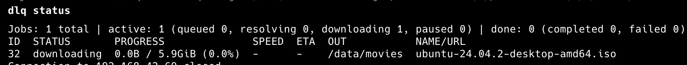
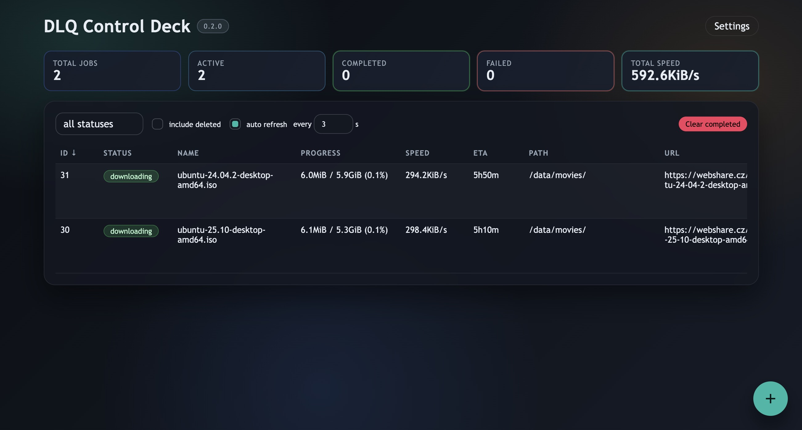
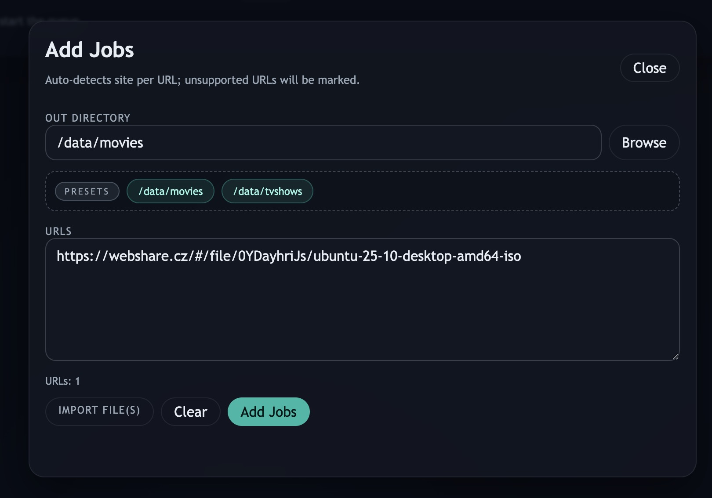

# DLQ (Download Queue)

[](https://github.com/Witriol/dlq-download-queue/actions/workflows/ci.yml)
[](https://go.dev)
[](LICENSE)

Minimal headless download-queue daemon + CLI inspired by JDownloader, designed for Docker and terminal use.

## Table of Contents

- [Features](#features)
- [Architecture](#architecture)
- [Quick start (Docker)](#quick-start-docker)
- [CLI](#cli)
- [UI (SvelteKit)](#ui-sveltekit)
- [How it works](#how-it-works)
- [Environment variables](#environment-variables)
- [Security](#security)
- [Docker Compose](#docker-compose)
- [Deploy to Unraid](#deploy-to-unraid)
- [Testing](#testing)
- [Development](#development)
- [License](#license)

## Features

- Persistent SQLite-backed job queue with retries, pause/resume, and soft delete
- Aria2-powered downloads with progress, speed, and ETA reporting
- Optional automatic archive decrypt/extract after download completion
- Pluggable URL resolvers (Webshare anonymous mode, HTTP/HTTPS passthrough)
- CLI for scripting and automation (`dlq add`, `dlq status --watch`, ...)
- Optional SvelteKit web UI with batch add, folder browser, and live dashboard
- Docker-first: runs as two containers (API + UI), supports `PUID`/`PGID`
- Unraid-friendly with deploy script and `DATA_*` volume presets

## Architecture

```
┌─────────────────────────────────────────────────────────────┐
│  Docker host                                                │
│                                                             │
│  ┌───────────────────────────────────────────────────────┐  │
│  │  dlq container                                        │  │
│  │                                                       │  │
│  │   ┌─────────┐    ┌──────────────────────────────┐     │  │
│  │   │  dlq    │───▶│  dlqd  (HTTP API :8099)      │     │  │
│  │   │  (CLI)  │    │                              │     │  │
│  │   └─────────┘    │  ┌──────────┐  ┌──────────┐  │     │  │
│  │                  │  │ resolver │  │  queue   │  │     │  │
│  │                  │  │ webshare │  │ service  │  │     │  │
│  │                  │  │ http(s)  │  └────┬─────┘  │     │  │
│  │                  │  │ mega     │       │        │     │  │
│  │                  │  └──────────┘       ▼        │     │  │
│  │                  │             ┌──────────────┐ │     │  │
│  │                  │             │  SQLite DB   │ │     │  │
│  │                  │             │ /state/dlq.db│ │     │  │
│  │                  │             └──────────────┘ │     │  │
│  │                  │                    │         │     │  │
│  │                  │                    ▼         │     │  │
│  │                  │             ┌──────────────┐ │     │  │
│  │                  │             │  downloader  │ │     │  │
│  │                  │             │  (aria2 RPC) │ │     │  │
│  │                  │             └──────┬───────┘ │     │  │
│  │                  └────────────────────┼─────────┘     │  │
│  │                                       ▼               │  │
│  │                                ┌─────────────┐        │  │
│  │                                │   aria2c    │        │  │
│  │                                │  (JSON-RPC) │        │  │
│  │                                └──────┬──────┘        │  │
│  │                                       ▼               │  │
│  │                                   /data/*             │  │
│  └───────────────────────────────────────────────────────┘  │
│                                                             │
│  ┌───────────────────────────────────┐                      │
│  │  dlq-webui container (optional)   │                      │
│  │                                   │                      │
│  │   SvelteKit app :8098 ───────────────▶ dlqd API :8099    │
│  │   (SSR, proxies API calls)        │                      │
│  └───────────────────────────────────┘                      │
│                                                             │
│  Browser ───▶ :8098 (UI)                                    │
│  Terminal ──▶ docker exec dlq dlq ...                       │
└─────────────────────────────────────────────────────────────┘
```

## Quick start (Docker)

```
docker build -t dlq:local .

docker run -d --name dlq \
  -p 8099:8099 \
  -v /path/to/downloads:/data \
  -v /path/to/state:/state \
  dlq:local
```

Add a job:

```
docker exec -it dlq dlq add <url> --out /data/downloads
```

Check status:

```
docker exec -it dlq dlq status
```

If you change the port, set `DLQ_HTTP_PORT` to match.

## CLI



- `dlq add <url> [<url2> ...] --out /data/downloads [--name optional] [--site mega|webshare|http|https] [--archive-password batch-pass]`
- `dlq add --file urls.txt --out /data/downloads`
- `dlq add --stdin --out /data/downloads`
- `dlq status` (summary + table)
- `dlq status --watch [--interval 1] [--status queued|resolving|downloading|paused|decrypting|completed|failed|decrypt_failed|deleted]`
- `dlq files` (shows all jobs in DB, including soft-deleted)
- `dlq logs <job_id> [--tail 50]`
- `dlq retry <job_id>`
- `dlq pause <job_id>`
- `dlq resume <job_id>`
- `dlq remove <job_id>` (soft delete)
- `dlq clear` (hard delete + reset IDs)
- `dlq settings` (show current settings)
- `dlq settings --concurrency <1-10> --auto-decrypt <true|false>` (update settings)
- `dlq help`

## UI (SvelteKit)




The UI is optional and lives under `ui/`. It proxies the DLQ HTTP API server-side.
The Unraid deploy script runs the UI as a separate container (`dlq-webui`) on `DLQ_WEBUI_PORT` (default `8098`).

```
cd ui
npm install
DLQ_API=http://127.0.0.1:8099 npm run dev
```

Presets for out_dir are served from `GET /meta` and derived from `DATA_*` volume mappings (container paths).

## How it works

- `dlqd` daemon stores jobs in SQLite, resolves URLs, and starts downloads in aria2 via JSON-RPC.
- Resolvers default to anonymous mode and surface blocking reasons as error codes:
  `login_required`, `quota_exceeded`, `captcha_needed`, `temporarily_unavailable`.
- `--site` forces a resolver; unknown values return `unknown_site`.
- Queue is persistent across restarts (`/state/dlq.db`).

## Environment variables

### DLQ

| Variable | Default | Description |
|----------|---------|-------------|
| `DLQ_STATE_DIR` | `/state` | Directory for state files |
| `DLQ_DB` | `/state/dlq.db` | Path to the SQLite database |
| `DLQ_HTTP_PORT` | `8099` | API server port |
| `DLQ_HTTP_HOST` | `0.0.0.0` | API server bind address |
| `DLQ_HTTP_ADDR` | — | Explicit `host:port` override (takes precedence over host/port) |
| `DLQ_API` | — | Client base URL for CLI/UI (e.g. `http://127.0.0.1:8099`) |
| `DLQ_WEBUI_PORT` | `8098` | Web UI container port |
| `PUID` / `PGID` | — | Run dlqd + aria2 as this user/group |
| `DATA_*` | — | Volume mappings (e.g. `DATA_TVSHOWS=/mnt/user/tvshows:/data/tvshows`) |

### Aria2

| Variable | Default | Description |
|----------|---------|-------------|
| `ARIA2_RPC` | `http://127.0.0.1:6800/jsonrpc` | Aria2 JSON-RPC endpoint |
| `ARIA2_RPC_LISTEN_PORT` | parsed from `ARIA2_RPC`, fallback `6800` | Aria2 listen port |
| `ARIA2_SECRET` | — | RPC secret token (recommended) |
| `ARIA2_DISABLE` | — | Set to `1` to disable the built-in aria2c process |
| `ARIA2_DIR` | first `DATA_*` path, fallback `/data` | Default download directory for aria2 |
| `ARIA2_EXTRA_OPTS` | — | Extra aria2c command-line flags |
| `ARIA2_MAX_CONNECTION_PER_SERVER` | `4` | Max connections per server |
| `ARIA2_SUMMARY_INTERVAL` | `0` | Summary log interval in seconds (0 = disabled) |
| `ARIA2_CONSOLE_LOG_LEVEL` | `warn` | Aria2 console log level |
| `ARIA2_SHOW_CONSOLE_READOUT` | `false` | Show aria2 console readout |

> **Note:** `concurrency`, `max_attempts`, and `auto_decrypt` are stored in `settings.json` under `DLQ_STATE_DIR` and can be updated via `dlq settings` or the UI. The file is created with defaults on first start.
>
> UI out_dir presets are derived from `DATA_*` env values (container paths); make sure they are passed into the container. All job `out_dir` values must live under one of the `DATA_*` container paths.

## Security

DLQ is designed for **trusted networks** (home LAN, Docker internal networking). The HTTP API has no authentication.

- **Do not** expose DLQ ports directly to the public internet. Use a reverse proxy with authentication (e.g., Caddy, Traefik, nginx) if remote access is needed.
- Set `ARIA2_SECRET` even in Docker to prevent unauthorized RPC access to aria2.
- All `out_dir` values are validated against `DATA_*` container paths to prevent path traversal.
- Credentials (e.g., for future resolver auth) should be provided via environment variables only; they are never logged.

## Notes

- Webshare resolver uses the public API in anonymous mode when possible and forces single-connection downloads for reliability.
- MEGA resolver supports public file links (`mega.nz/file/...`) by resolving temporary download URLs and decrypting MEGA file payloads after download.
- Auto decrypt/extract runs after successful download for archive extensions (`.zip`, `.rar`, `.7z`, `.tar*`, `.gz`, `.bz2`, `.xz`) when `auto_decrypt=true` in settings.
- Pass `--archive-password` in `dlq add` (or `archive_password` in API/UI) for password-protected archives in that add batch.
- DLQ tries `7zz` first; if needed (unsupported/open-as-archive RAR errors, or missing `7zz` binary) it automatically retries with `unar`.
- One add batch uses one password for all links; for different passwords, add links in separate batches.
- If decrypt/extract fails (missing/wrong password, tool error), the job moves to `decrypt_failed` and the failure is logged to job events.
- If aria2 restarts, `dlq resume <id>` will re-queue the job and re-resolve the URL.
- If you set `PUID`/`PGID`, ensure `/data` and `/state` are writable by that user on the host.
- If you see `attempt to write a readonly database`, fix permissions on the host (e.g., `chown -R 99:100 /path/to/state`).

## Docker Compose

```bash
# Copy the example compose file and edit paths/ports
cp docker-compose.example.yml docker-compose.yml

# Start the service
docker-compose up -d
```

Note: keep the API port consistent across `DLQ_HTTP_PORT`, the `ports` mapping, and the web UI `DLQ_API` value.

## Deploy to Unraid

```bash
# Copy .env.example to .env and edit it
cp .env.example .env

# Build, transfer, and deploy containers
scripts/deploy-unraid.sh all

# Deploy only the CLI/API container
scripts/deploy-unraid.sh cli

# Deploy only the web UI container
scripts/deploy-unraid.sh webui
```

The `.env` file is your single source of truth for deployment configuration:
- `REMOTE_HOST` - SSH alias for your Unraid server
- `DATA_*` - Volume mappings (e.g., `DATA_TVSHOWS=/mnt/user/tvshows:/data/tvshows`)
- `STATE_MOUNT` - State/config volume mapping
- `DLQ_HTTP_PORT` - Port for the DLQ API container
- `DLQ_WEBUI_PORT` - Port for the web UI container
- `PUID`/`PGID`/`TZ` - Runtime user and timezone settings

The deploy script automatically discovers all `DATA_*` variables and passes them through so presets can be derived in the app.

## Version

```
dlq --version
```

## Testing

Use this single flow for local verification:

```bash
# 1) Ensure Docker is running
docker info

# 2) Prepare local dev env file (needed by script integration test)
cp -n .env.example .env.dev

# 3) Run all Go tests (unit + integration), verbose and without cache
go test -v -count=1 ./...

# 4) Verify web UI build
cd ui
npm install
npm run build
```

## Development

```
cp .env.example .env.dev
scripts/run-dev.sh
```

## License

MIT. See `LICENSE`. Third-party notices in `THIRD_PARTY_NOTICES.md`.
